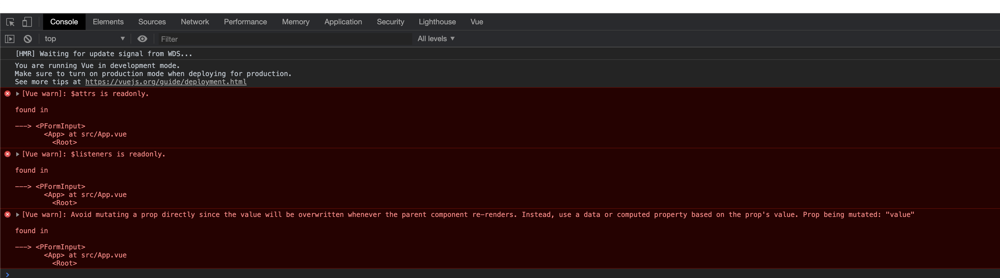

# How to reproduce the warning

Run `yarn install && yarn build`

After it, run `yarn link`

In the consumer project, run `yarn link vue-components`

Create component where it uses the form-input component:

```vue
<template>
  <div id="app">
    <p-form-input type="text" name="some_input" v-model="inputValue" /> {{ inputValue }}
  </div>
</template>

<script lang="ts">
import Vue from 'vue'

import PFormInput from 'vue-components/esm/components/form-input'

export default Vue.extend({
  name: 'App',
  components: {
    PFormInput,
  },
  data() {
    return {
      inputValue: 'normal'
    }
  }
})
</script>
```

It will complain about no types found, ignore it. When you run it and try to enter something in the input, it will throw 3 warnings...


